# In Situ Recognition of Laboratory Actions

This repository contains the software used in the article: ....

## Abstract

The reliable transfer of experimental knowledge is central to chemical discovery, yet much of the procedural information generated in wet laboratories is still captured as incomplete, unstructured, and manually written records. This limits reproducibility, obscures tacit experimental knowledge, and prevents routine laboratory practice from being reused by computational and autonomous chemistry workflows. Here, we introduce a hands-free framework for self-documenting chemical experiments, in which laboratory actions are captured during execution and converted into structured, machine-readable data. The system integrates dual video streams directly within a standard laboratory fume hood with electronic laboratory notebook (ELN)–based action annotation, enabling continuous, time-synchronized acquisition of labeled video data under realistic working conditions. Using this platform, we collected approximately 7,000 labeled video fragments covering common wet-laboratory operations and used them to fine-tune a pretrained computer vision model for action recognition. The model achieved up to 84% accuracy across five action classes and retained practical performance during prospective deployment, correctly identifying experimental operations in approximately 70% of cases. More broadly, this work establishes a practical route toward AI-compatible experimental records, where human laboratory practice can be captured, structured, and reused as data for reproducible and data-driven chemical research. 


## Hardware material

List of the materials used and map of the setup.
<ul>
<li>Yocto-Meteo-V2
<li>Svpro 4K Webcam
<li>Infiray P2Pro
<li>WaveShare 7inch HDMI Touch Screen
</ul>

<ul>
<li>2x MOKOSE 12MP HDMI Camera
<li>Yocto-Light-V3
</ul>

<ul>
<li>5m HDMI cable
<li>2x 3m USB-A USB-A cables
<li>3x 3m microUSB-USB-A cables 
<li>3m USB-A USB-A extension
<li>7-USB port docker
</ul>

<p align="center">
    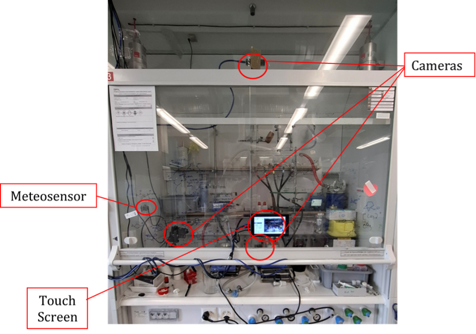
</p>

## Data acquisition softwares

The following work provides a coombination of software tools designed and employed for both acquisition of data and direct predictions in prospective analysis. The tools were developed on top of the ELN Chemotion, it is composed of two softwares that work synchronously: *VideoManager* and *ELNScribe*. 

#### VideoManager

The *VideoManager* tool manages the recording of the cameras placed in the fume-hood and takes care of creating the labels for the videos dataset. At the first use, a windows allows the introduction of requires credentials to access the ELN and the sensor API, select the destination folders and the model for the predictions. The Chemoton.json address and the cookies of the ELN can be obtained from any browser. 

<p align="center">
    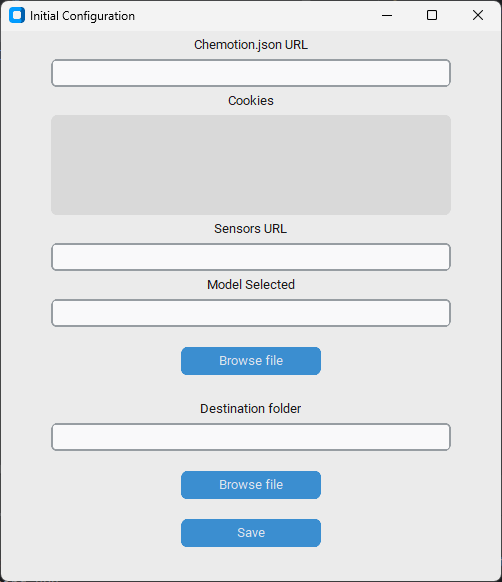
</p>

Given the high number of cameras employed in the project, when the software its initialized, a window allows the selection of the right cameras.
<p align="center">
    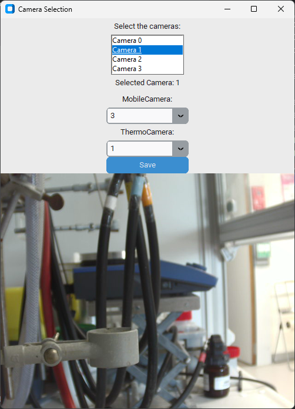
</p>
The recording is active only when the light of the fume-hood is on, and starts only if movement is detected. The video stops after 20 seconds of inactivity or upon deactivation of the light. The buttons placed on top allow to switch view between the two cameras, ensuring complete framing of the action. The recordings report the number of the relative camera and the time for reliable association with the notes. 

<p align="center">
    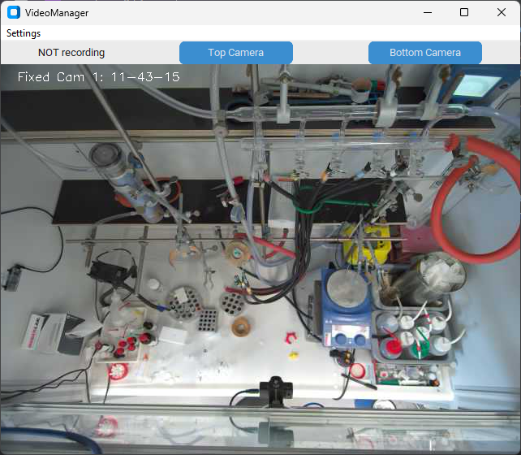
    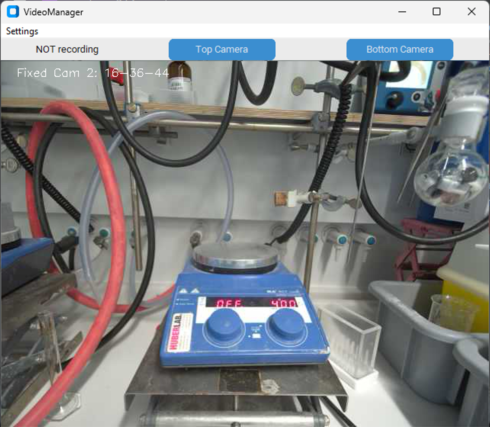
</p>

In background, the system checks when a reaction's status is changed to `Successful` or `Not Successful` and extracts the description separating the actions by day and ordering them chronologically. The output of this software is a folder containing the videos recorded and the notes extracted per date. Finally, the generated videos are used in the generation of the prediction by the selected model.

#### ELNScribe

The *ELNScribe* software is an extension of the ELN Chemotion, giving access to it and allowing to write in the reaction's description the executed action with a couple of clicks. Thanks to it, the chemist is able to interact with the ELN without leaving the fume-hood. Once more, at first use, a popup will allow the introduction of the user credentials of the ELN.
<p align="center">
    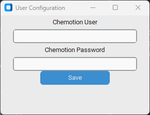
</p>
After that, the program starts with the selection of a *MobileCamera* and a *ThermoCamera* with a similar window to the other software.  
In the main window, the upper part of the interface presents a list of the reaction that are not marked as completed. Each reaction name has a different color depending on its status; specifically:

⚫ Black: Reaction `Planned`

🟡 Yellow: Reaction `Running`

🔵 Blue: Reaction `Done`

<p align="center">
    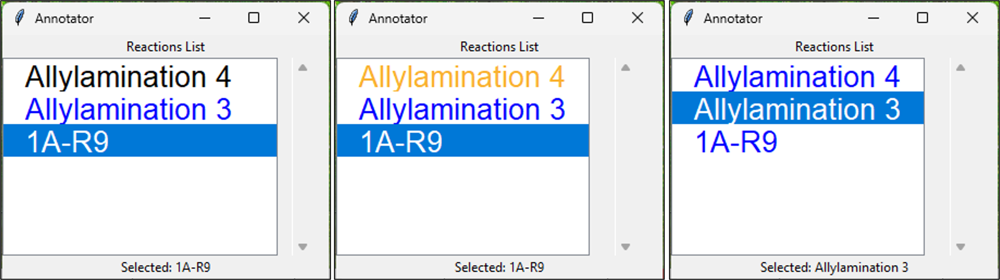
</p>
Below the listbox, a label specifies the name of the selected item. By right-clicking on one of the reaction in the listbox, a window will pop-up. The window contains a table with the list of the chemicals used in that reaction and their quantities; below the table the text reported in the section 'Additional information' where the procedure to follow can be pasted in. This will help the user to check the quantities to add and the procedure to follow in a practical and efficient way. 
<p align="center">
    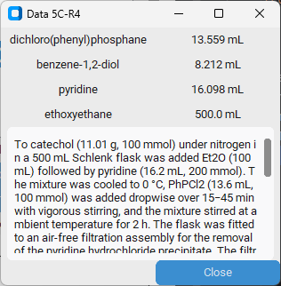
</p>
In the central part of the interface, 4 different buttons are found: 
<ul>
    <li> Start Reaction: Marks the reaction as `Running` and starts the reaction time.
    <li> Stop Reaction: Marks the reaction as `Done` and stops the reaction time.
    <li> Show Actions: Opens a pop-up containing the main actions performed in a chemical procedure. 
        <p align="center">
            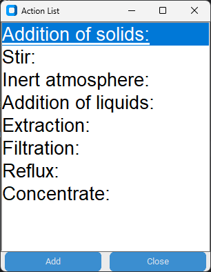
        </p>
        By selecting the action just performed and confirming by pressing the button `Add` on the pop-up, the software adds the selected keyword in the description of the selected reaction specifing the date and the time. This function is available in case of Action that are not predictable by the model. 
    <li> Cameras: Opens a window where the mobile camera is displayed. The windows present in the video-panel a region of interest (ROI) defined by a blue rectangle. The rectangle shows on the top part the name of the selected reaction and almost at the bottom a gray box displayed. The dimension of the ROI can be modified by left click and dragged by right click. 
    <p align="center">
        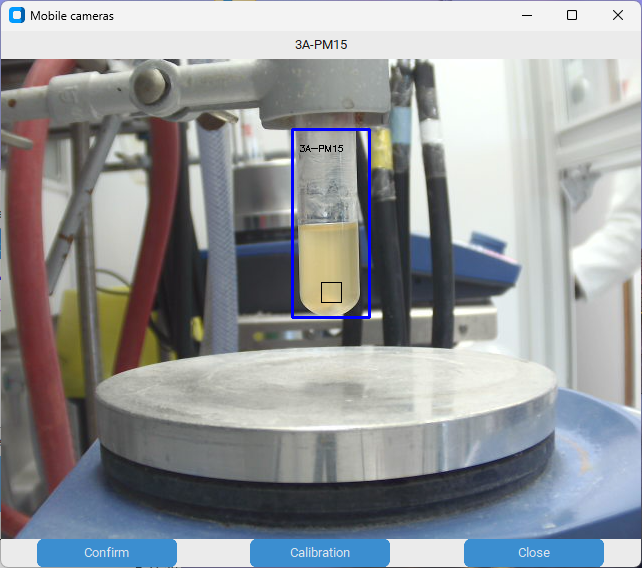
    </p>
    This allows the user to position the ROI on the flask of the relative reaction with the gray box in the middle of the reaction solution. Once the ROI is well positioned, the confirm button can be pressed. When a reaction is labelled as Running, the ROI becomes red and shape and position cannot be modified. Additionally, a `Calibration` button is present, which upon activation shows a third window pops up displaying the normal camera and the thermic camera side by side, allowing the user to allign the 2 cameras.
    <p align="center">
        
    </p>
</ul>
In the lower part of the interface, a series of radiobuttons can be found with a canva containing a graph underneath. When a reaction is started, the software monitors data from the Yocto-Meteo-V2, collecting the actual room temperature, atmospheric pressure and humidity percentage in the fume-hood. Those values are collected every 30 seconds and stored in a csv file, from there, the software plots and shows the collected data, updating them at every acquisition. Moreover, if a reaction is `Running` at room temperature, the software upload the value of the temperature detected by the Yocto-Meteo-V2 in the ELN. 
The radiobuttons allow to switch from a parameter to another, changing the displayed graph. 
<p align="center">
    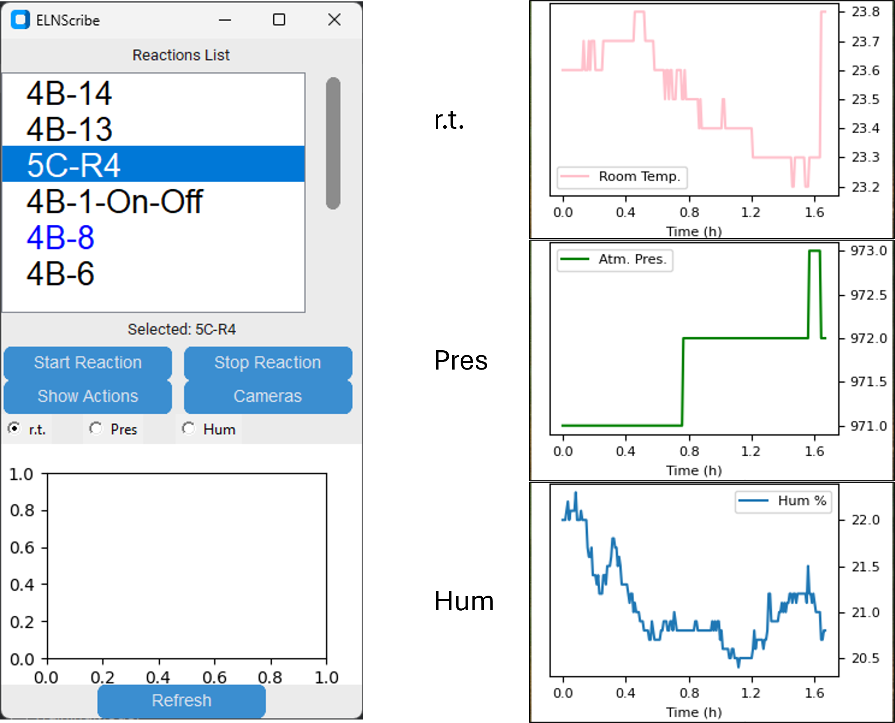
</p>
If the ROI was confirmed for a reaction, 2 additional radiobuttons appear in the Graphic interface. The software, in addition to the parameters from the Yocto-Meteo-V2, collects the average values color and temperature detected by the camera and the thermic camera in the gray box of the selected region of interest and allow the visualisation of those as well. 
<p align="center">
    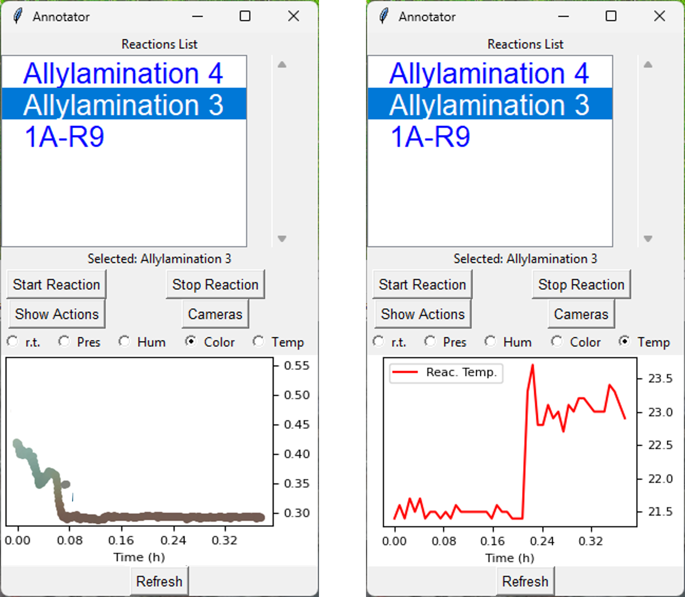
</p>

It is important to highlight that this last program can be used alone, representing an useful tool to interact with the ELN by itself.

## Dataset

The dataset collected with the system and employed in the training of the models are provided as `.mp4` files with a `label.json` file containing the labels per filename. The videos are named as `Cam1` or `Cam2` depending on the camera source, followed by the date of acquisition. The dataset used in the retrospective analysis had to be chuncked in 4 second long videos, and therefore contain chunck number in the name. For the retrospective analysis dataset and the future acquired data the system provides already videos of the lenght of 4 seconds and the contigous videos are considered with the same label. 

## Development setup & installation
To install the package run:


```console
pip install uv

uv init .
uv venv
source .venv/bin/activate
uv pip install -e .
```

## Training

The training pipeline is implemented in the `TrainingModel/` folder and is based on PyTorch. It expects a dataset of labeled video clips and a precomputed train/validation/test split.

### 1. Data preparation

Before training, the dataset must be prepared and split:

- Videos (`.mp4`) and labels (`label.json`) should follow the structure described above
- Use the provided scripts:
  - `DataPreparation.py` → prepares the dataset and converts labels into a training-ready format
  - `DataSplitting.py` → creates train/validation/test splits

These steps produce JSONL files used during training (one entry per video sample).

### 2. Train the model

Training is performed with:

```console
python TrainingModel/train.py
```

You will be prompted to provide:

- path to the folder containing the dataset splits
- path to the folder containing the video dataset

Example:

```console
Input the path of the folder containing the splits: /path/to/splits/
Input the path of the folder containing the dataset to use: /path/to/videos/
```

### 3. Evaluate a trained model

Model evaluation is performed with:

```console
python TrainingModel/evaluate.py <model_checkpoint>
```

You will be prompted to provide:

- path to the trained model folder
- path to the dataset used for evaluation

The script loads the trained model and computes:

- accuracy
- precision / recall / F1-score
- confusion matrix

Logs are stored in `eval_info__.log`.

### 4. Notes & recommendations

- Ensure videos are consistently preprocessed (same FPS and duration where possible)
- Keep label encoding consistent between training and evaluation
- GPU is strongly recommended for faster training
- Training automatically supports CPU, CUDA, and Apple MPS (if available)


